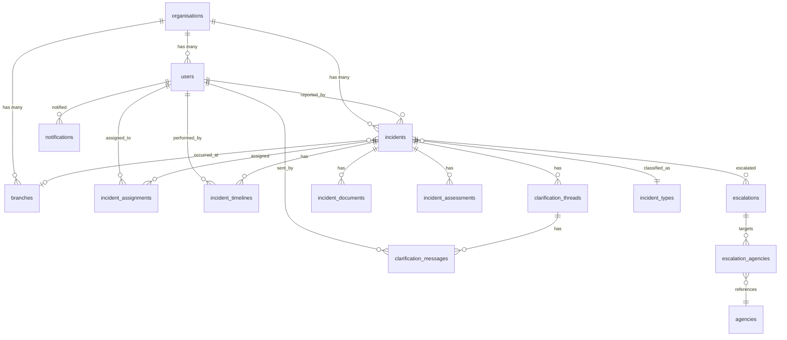

# 🛡️ Sentinel Hub — Postal Security Incident Reporting Platform (PSIRP)

> A centralized, role-based incident reporting and case management platform built for the **Malaysian Communications and Multimedia Commission (MCMC)** to govern and monitor postal & courier security incidents across licensed operators nationwide.

---

## 📋 Table of Contents

- [Overview](#overview)
- [Key Highlights](#key-highlights)
- [Technology Architecture](#technology-architecture)
- [API — Shared Backend](#api--shared-backend)
- [Authentication & Security](#authentication--security)
- [User Roles & Portals](#user-roles--portals)
  - [Licensee Reporter](#1-licensee-reporter)
  - [Licensee Admin](#2-licensee-admin)
  - [MCMC Case Officer](#3-mcmc-case-officer-reviewer)
  - [MCMC Supervisor](#4-mcmc-supervisor-validator)
  - [MCMC Internal](#5-mcmc-internal-investigator)
  - [MCMC System Admin](#6-mcmc-system-admin)
  - [MCMC Super Admin](#7-mcmc-super-admin)
  - [Agency (LEA Viewer)](#8-agency-lea-viewer)
- [Shared Features](#shared-features)
- [Incident Workflow](#incident-workflow)
- [Database Schema](#database-schema)

---

## Overview

**Sentinel Hub** (codenamed **PSIRP** — Postal Security Incident Reporting Platform) is a multi-tenant, role-based web and mobile application designed to streamline the end-to-end lifecycle of postal and courier security incidents in Malaysia. The platform is built for use by licensed postal and courier operators (licensees), MCMC internal staff, and external law enforcement agencies (LEAs).

The system is powered by a **Laravel (PHP) RESTful API** backend that serves both the **Next.js** web application and the **Flutter** mobile application. All business logic, authentication, authorization, and data management are centralized in the Laravel API, ensuring a single source of truth across all client platforms.

It enables:
- **Fast incident reporting** with guided, multi-step submission forms
- **Real-time case tracking** with live status updates and clarification threads
- **Structured case review & escalation workflows** from officer → supervisor → LEA
- **Governance analytics** with dashboards, charts, and heatmaps at every level
- **National-level oversight** with AI-powered predictive analytics and geographic visualization
- **Cross-platform access** via web browser (Next.js) and mobile devices (Flutter for iOS & Android)

---

## Key Highlights

| Feature | Description |
|---|---|
| 🔐 **Role-Based Access Control** | 8 distinct user roles, each with a dedicated sidebar layout, dashboard, and feature set |
| 📝 **Multi-Step Incident Form** | 6-section guided form with auto-save, progress stepper, and draft management |
| 🔄 **Case Lifecycle Management** | Full workflow from Draft → Submitted → In Review → RFI → Escalated → Closed |
| 💬 **Clarification Threads** | Bi-directional communication between reporters and case officers |
| 📊 **Analytics & Dashboards** | Recharts-powered pie charts, bar charts, line charts, and stacked bar charts |
| 🗺️ **Malaysia Incident Heatmap** | Google Maps-powered geographic visualization of incidents by state |
| 🤖 **AI Predictive Insights** | Simulated AI analytics for forecasting, risk alerts, and policy recommendations |
| 🌐 **Bilingual Support** | Language toggle (BM/EN) in the global header |
| 🌙 **Dark/Light Theme** | Full dark mode support via `next-themes` with system preference detection |
| 🔔 **Notification System** | Real-time notification bell popover with unread indicators |
| 📤 **Export & Report Generation** | Selective multi-row export with checkbox selection mode |
| 🧭 **Guided Workflow** | Clear escalation paths with supervisor approval gates |

---

## Technology Architecture

| Layer | Technology | Purpose |
|---|---|---|
| **Backend API** | Laravel (PHP) | RESTful API, business logic, authentication (Sanctum), authorization (Policies & Gates), database ORM (Eloquent), queue jobs, event broadcasting |
| **Web Frontend** | Next.js (React) | Server-side rendered web application consuming the Laravel API |
| **Mobile App** | Flutter (Dart) | Cross-platform iOS & Android mobile application consuming the same Laravel API |
| **Database** | MySQL / PostgreSQL | Primary relational database with UUID primary keys |
| **File Storage** | Laravel Storage (S3 / local) | Incident attachments, evidence documents, exports |
| **Authentication** | Laravel Sanctum | Token-based API authentication for both web and mobile clients |
| **Real-Time** | Laravel Broadcasting (Pusher/Reverb) | Real-time notifications and live case status updates |
| **Queue** | Laravel Queue (Redis) | Async jobs for email notifications, report generation, audit logging |
| **Caching** | Redis | API response caching, session management, rate limiting |

```
┌─────────────────┐    ┌─────────────────┐
│   Next.js Web   │    │  Flutter Mobile  │
│   Application   │    │  (iOS/Android)   │
└────────┬────────┘    └────────┬────────┘
         │                      │
         │     HTTPS / JSON     │
         └──────────┬───────────┘
                    │
                    ▼
         ┌─────────────────────┐
         │   Laravel API       │
         │   (RESTful + Auth)  │
         └──────────┬──────────┘
                    │
          ┌─────────┼─────────┐
          ▼         ▼         ▼
     ┌────────┐ ┌───────┐ ┌────────┐
     │ MySQL/ │ │ Redis │ │   S3   │
     │ PgSQL  │ │       │ │Storage │
     └────────┘ └───────┘ └────────┘
```

---

## API — Shared Backend

The Laravel backend exposes a **single RESTful API** that is consumed by **both** the Next.js web application and the Flutter mobile application. This architecture ensures:

- **Single source of truth** — All business logic, validation, and authorization rules live in the Laravel backend
- **Consistent data** — Both web and mobile clients receive identical API responses
- **Centralized security** — Authentication (Sanctum tokens), role-based authorization (Policies & Gates), and input validation (Form Requests) are enforced at the API layer
- **Code reuse** — Service classes, enums, and models are shared across all API consumers
- **Independent deployability** — Web, mobile, and API can be deployed and scaled independently

### API Authentication Flow

| Step | Endpoint | Description |
|---|---|---|
| 1 | `POST /api/auth/login` | Submit email, password, and role. Returns temporary token for MFA |
| 2 | `POST /api/auth/verify-otp` | Submit 6-digit OTP. Returns full Sanctum bearer token |
| 3 | `POST /api/auth/logout` | Revoke current token |
| 4 | `POST /api/auth/forgot-password` | Initiate password reset email |
| 5 | `POST /api/auth/reset-password` | Submit new password with reset token |

All subsequent API requests include the bearer token in the `Authorization` header. The API returns JSON responses with consistent error formatting across all endpoints.

---

## Authentication & Security

The authentication flow consists of three stages:

### 1. Role Selection (`/choose-role`)
Users select their role from a card-based grid showcasing all 6 primary roles (Licensee Admin, Licensee Reporter, MCMC Case Officer, MCMC Supervisor, MCMC Internal, Agency). Each role card displays a unique icon, color theme, and description.

### 2. Login (`/login`)
A branded login form with:
- MCMC logo and platform branding
- Role chip indicator showing the selected role
- Email and password fields (auto-fill with demo credentials on focus)
- Forgot password flow with email reset simulation
- IT Helpdesk contact information in footer

### 3. MFA / OTP Verification (`/otp`)
After successful credential verification:
- 6-digit one-time password input using `input-otp` library
- Role-themed styling for the verification UI
- Demo OTP displayed for testing purposes (in production, sent via email/SMS)
- Successful verification redirects to the user's role-specific dashboard

### Forgot Password (`/forgot-password`)
A complete 4-view password reset flow:
1. **Request** — Enter email address
2. **Sent** — Confirmation that link was sent (with simulate button)
3. **Reset** — New password form with real-time strength meter and requirement checklist
4. **Success** — Confirmation with redirect to login

### Protected Routes
All role-specific routes are wrapped in a `<ProtectedRoute>` component that checks for an authenticated user and redirects unauthenticated visitors to `/login`.

---

## User Roles & Portals

Each role has a dedicated sidebar layout, dashboard, and feature set. The sidebar navigation, color theme, and role icon are defined centrally in `roleConfig.ts`.

---

### 1. Licensee Reporter

> **Purpose:** Submit and track postal security incidents on behalf of a licensed operator.

| Route | Page | Description |
|---|---|---|
| `/licensee-reporter/dashboard` | **Dashboard** | Personal overview with KPI cards (Drafts, Submitted, Under Review, Escalated, Closed), pie chart for case status distribution, bar chart for monthly submissions, drafts expiry list, and "Create New Incident" button |
| `/licensee-reporter/incidents` | **My Submissions** | Full incident list with tabular view, search/filter by status, date filter, severity badges, escalation indicators, and multi-select export mode with checkbox row selection |
| `/licensee-reporter/incidents/new` | **New Incident Form** | 6-step guided incident submission form (see details below) |
| `/licensee-reporter/incidents/:id` | **Incident Details** | Read-only view of a submitted incident with all form sections rendered in a structured format, supporting documents list, and clarification thread |
| `/licensee-reporter/drafts` | **Drafts** | Draft management with expiry countdown badges, continue/delete actions, and days-left indicators |
| `/licensee-reporter/notifications` | **Notifications** | Full notification list with read/unread states, icons, and timestamps |
| `/licensee-reporter/analytics` | **Analytics** | Personal analytics dashboard |
| `/licensee-reporter/profile` | **Profile & Security** | Profile information and security settings page |

#### New Incident Form — 6-Step Wizard

| Step | Section | Fields |
|---|---|---|
| 1 | **Reporter Information** | Company name, registered address, reporter name, designation, official email, contact number, fax, alternative contacts |
| 2 | **Incident Type** | Primary incident type classification (Theft, Loss, Dangerous Goods, Tampering, Fraud, etc.) |
| 3 | **Incident Details** | Date/time, location, branch, staff who detected, system/service affected, observed impact, sender/recipient info, tracking number, package declaration, weight, prohibited item type |
| 4 | **Actions Taken** | Immediate actions, containment status, assistance requested, authority reporting, parcel handover status |
| 5 | **Supporting Documents** | File attachment upload area and link/description field for external references |
| 6 | **Review & Declaration** | Full form summary for review, declaration checkbox, and date stamp |

Features:
- Auto-save every 15 seconds with timestamp indicator
- Step progress stepper with visual completion indicators
- Save as Draft at any point
- Smooth scroll-to-top on step transitions
- Final submission generates a reference ID (e.g., `ABXX0020`) and records the timestamp

---

### 2. Licensee Admin

> **Purpose:** Manage the organisation's users, oversee all incident submissions, and monitor organisational performance.

| Route | Page | Description |
|---|---|---|
| `/licensee-admin/dashboard` | **Dashboard** | Organisational overview with 5 KPI cards (Total Incidents, Draft Reports, Under Review, Escalated, Closed), donut chart for case status distribution, stacked bar chart for case type analysis by month |
| `/licensee-admin/incidents` | **All Incidents** | Complete list of all organisational incidents with search, status filter, severity filter, and date range filter |
| `/licensee-admin/incidents/:id` | **Incident Details** | Detailed incident view for review |
| `/licensee-admin/drafts` | **Draft Reports** | Organisation-wide draft management |
| `/licensee-admin/under-review` | **Under Review** | Incidents currently being reviewed by MCMC |
| `/licensee-admin/escalated` | **Escalated Cases** | Incidents that have been escalated |
| `/licensee-admin/closed` | **Closed Cases** | Archived/closed incidents |
| `/licensee-admin/users` | **User Management** | Manage organisation users (reporters) |
| `/licensee-admin/analytics` | **Analytics** | Organisational analytics dashboard |
| `/licensee-admin/notifications` | **Notifications** | Admin notifications |
| `/licensee-admin/security` | **Security Settings** | Organisation security configuration |
| `/licensee-admin/testing` | **Testing** | Testing/sandbox environment |

---

### 3. MCMC Case Officer (Reviewer)

> **Purpose:** Review incoming incident submissions, request clarifications, perform initial assessments, and manage case progression.

| Route | Page | Description |
|---|---|---|
| `/case-officer/dashboard` | **Dashboard** | Personal work overview with KPI cards (Assigned Cases, High Severity, Escalation Pending, Clarification Pending, Priority Alerts), "Go to Case Monitoring" action button, and recent assigned cases list |
| `/case-officer/inbox` | **Inbox** | Incoming case queue for review assignment |
| `/case-officer/all-cases` | **All Cases** | Complete case monitoring table with advanced filters |
| `/case-officer/incidents` | **Incidents** | Incident listing with status management |
| `/case-officer/cases/:id` | **Case Review** | Comprehensive case review workspace (see details below) |
| `/case-officer/search` | **Search** | Advanced case search with multiple filter parameters |
| `/case-officer/reports` | **Reports** | Report generation and export |
| `/case-officer/announcements` | **Announcements** | Internal announcements board |
| `/case-officer/notifications` | **Notifications** | Case officer notifications |
| `/case-officer/security` | **Security** | Profile and security settings |

#### Case Review Workspace — Tabbed Interface

| Tab | Features |
|---|---|
| **Case Details** | Full incident data rendered in a structured read-only view (shared `CaseDetailsView` component) |
| **Clarification** | Bi-directional threaded communication with the reporter. Request for Information (RFI) thread with message status (Sent, Responded, Awaiting Response), new message indicators, and reply composer |
| **Timeline** | Chronological audit trail showing all case events (submission, acknowledgement, assignment, status changes) with actors and timestamps |
| **Assessment & Actions** | Officer's initial assessment workspace with severity level selector, preliminary findings text area, private internal notes, peer comment thread, and case actions |

#### Case Actions

| Action | Behavior |
|---|---|
| **Under Review** | Move case to "Under Review" status |
| **Close Case** | For Low/Medium severity: Officer can close directly with a summary. For High/Critical severity: Submits a "Recommendation for Closure" routed to Supervisor |
| **Propose Escalation to LEA** | Opens a dialog to select LEA agencies (PDRM, KASTAM, MOH, KDN, AKPS, etc.) with search, multi-select, and justification text. Submitted for Supervisor approval |

---

### 4. MCMC Supervisor (Validator)

> **Purpose:** Approve escalations, finalize case decisions, oversee case officer workload, and ensure governance compliance.

| Route | Page | Description |
|---|---|---|
| `/supervisor/dashboard` | **Dashboard** | Governance overview with KPIs (Total Open Cases, Pending Tasks, Closed This Month, Escalated), priority alert cards (Critical Incident Alert, Escalation Approval Alert), and Pending Tasks Queue with severity badges |
| `/supervisor/cases` | **Case Monitoring** | Full case monitoring with advanced filtering, sorting, and bulk actions |
| `/supervisor/cases/:id` | **Case Detail** | Detailed case view with approval/rejection capabilities |
| `/supervisor/escalations` | **Escalation Queue** | Pending escalation requests awaiting supervisor endorsement |
| `/supervisor/escalations/:id` | **Escalation Detail** | Individual escalation review and approval |
| `/supervisor/audit` | **Audit & Compliance** | Audit trail review, compliance checks, and governance reporting |
| `/supervisor/search` | **Search & Filter** | Advanced case search with multi-parameter filtering |
| `/supervisor/analytics` | **Analytics** | Supervisory analytics and team performance |
| `/supervisor/notifications` | **Notifications** | Supervisor notifications with priority alerts |
| `/supervisor/security` | **Security** | Profile and security settings |

---

### 5. MCMC Internal (Investigator)

> **Purpose:** Strategic oversight, cross-organisational governance analytics, and internal performance monitoring.

| Route | Page | Description |
|---|---|---|
| `/internal/dashboard` | **Governance Dashboard** | Strategic overview with 6 KPIs (Total Cases, Open Cases, Escalated Cases, Closed Cases, Escalation Ratio %, High Severity), bar chart for "Cases by Organisation" (Global Express, Pos Malaysia, J&T Express, CityLink, DHL eCommerce), pie chart for severity distribution, and "Recently Closed Cases" list with outcome badges |
| `/internal/cases` | **All Cases** | Organisation-wide case listing with cross-licensee visibility |
| `/internal/cases/:id` | **Case Detail** | Comprehensive case detail view |
| `/internal/analytics` | **Analytics** | Multi-organisation analytics |
| `/internal/notifications` | **Notifications** | Internal notifications |
| `/internal/security` | **Security** | Profile and security settings |

Additional pages available:
- **Audit & Compliance** — Governance audit reviews
- **Performance** — Officer and team performance metrics
- **Reports** — Report generation

---

### 6. MCMC System Admin

> **Purpose:** Configure system settings, manage users and organisations, maintain master data, and monitor system health.

| Route | Page | Description |
|---|---|---|
| `/admin/dashboard` | **System Admin Dashboard** | Administration overview with KPI cards (Total Licensees: 124, Active Users: 487, Total Incidents: 2,847, System Health: 99.7%), Quick Actions panel, AI Platform Insights (SLA Performance, Resource Planning, System Optimization), and Recent Configuration Changes audit log |
| `/admin/users` | **User Management** | Create, edit, deactivate users across all roles; assign roles and organisations |
| `/admin/organisations` | **Organisation Management** | Manage licensee organisations — registration, status, contact info |
| `/admin/master-data` | **Master Data** | System reference data management (incident types, severity levels, categories, SLA rules) |
| `/admin/audit-logs` | **Audit Logs** | Complete system audit trail with user actions, timestamps, and change details |

---

### 7. MCMC Super Admin

> **Purpose:** National-level oversight with full system access, AI-powered analytics, geographic visualization, and strategic decision support.

| Route | Page | Description |
|---|---|---|
| `/super-admin/dashboard` | **Super Admin Dashboard** | The most comprehensive dashboard featuring: |

#### Dashboard Components

| Component | Description |
|---|---|
| **National KPIs** | Total Incidents (2,847), This Month (156, +12%), High-Severity YTD (87) |
| **Malaysia Incident Heatmap** | Interactive Google Maps integration showing incident density by city with severity-coded markers (Critical/High/Medium/Low), clickable info windows, legend, and total coverage stats |
| **Regional Incident Distribution** | Horizontal bar chart showing incidents by region (Klang Valley, Johor, Penang, Sabah, Sarawak, Perak, Others) |
| **Top 5 Incident Categories** | Progress bar chart showing Loss (842), Theft (612), Dangerous Goods (487), Tampering (356), Fraud (298) with percentages |
| **AI Predictive Analytics** | Simulated AI insights — Q4 Forecast, Risk Alerts (flagging high-severity routes), and Policy Recommendations |
| **Monthly Incident Trend** | Dual-line chart showing Total Incidents vs. Resolved over 12 months |
| **Category Trend Over Time** | Stacked bar chart showing Loss/Theft/Dangerous Goods/Tampering/Fraud trends monthly |
| **Severity Distribution** | Pie chart with labeled percentage breakdowns |
| **Workflow Performance Metrics** | 4 metric cards showing Avg Review Time (4.2 hrs), Avg Validation Time (2.8 hrs), Avg Investigation (3.5 days), Total Resolution (7.2 days) with progress bars |
| **Quick Actions** | AI Analytics, Generate Global Report, Audit Center |
| **System Status** | Service health monitor (Incident Reporting, Case Management, LEA Integration, Analytics Engine) with uptime percentages |

---

### 8. Agency (LEA Viewer)

> **Purpose:** View and investigate escalated cases referred by MCMC to external law enforcement agencies (e.g., PDRM, KASTAM).

| Route | Page | Description |
|---|---|---|
| `/lea/dashboard` | **Agency Dashboard** | Agency overview (e.g., PDRM) with KPIs (Total Cases, Open Cases, Escalated Cases, Closed Cases), High Risk Alert widget, Cases Pending Acknowledgement list with severity and escalation date, and Recently Closed Cases with outcome badges |
| `/lea/cases` | **Case List** | Escalated case listing with filters |
| `/lea/cases/:id` | **Case Detail** | Detailed case view with acknowledgement, investigation notes, and status update capabilities |
| `/lea/analytics` | **Analytics** | Agency-specific analytics |
| `/lea/notifications` | **Notifications** | Agency notifications |
| `/lea/security` | **Security** | Profile and security settings |

---

## Shared Features

These features are available across multiple roles via shared components:

### Global Header
- MCMC logo and platform title
- Language toggle (BM / EN)
- Dark/Light theme toggle
- Notification bell with popover showing recent notifications with unread count
- User profile dropdown (name, email, role, profile link, logout)
- Sticky positioning with backdrop blur

### Case Details View (`CaseDetailsView`)
A standardized, read-only incident detail renderer used across Reporter, Case Officer, Supervisor, Investigator, and LEA views. Displays all form sections in a structured card layout.

### Case Clarification Thread (`CaseClarificationThread`)
A bi-directional messaging component for RFI (Request for Information) between Case Officers and Reporters. Features:
- Message thread with role indicators (Officer / Reporter)
- Response status badges (Sent, Responded, Awaiting Response)
- New message indicators
- Reply composer with send button

### Case Timeline (`CaseTimeline`)
A chronological event log showing all status changes with:
- Event description
- Actor (who performed the action)
- Timestamp
- Event type icon (submission, system, update)

### Case Header (`CaseHeader`)
A standardized case header bar with:
- Case ID and title
- Company/organisation name
- Severity and status badges
- Submission date
- Back navigation button

### Analytics Dashboard (`AnalyticsDashboard`)
A comprehensive analytics component with configurable charts, used by multiple roles to display role-specific data visualizations.

### Profile & Security (`ProfileSecurityCards`)
Shared profile and security management cards providing:
- Personal information management
- Password change with strength validator
- Security settings

### Password Strength Validator
A reusable password strength assessment component with:
- Real-time strength bar (Weak/Fair/Good/Strong)
- Requirement checklist (length, uppercase, lowercase, number, special character)
- ARIA accessibility support

---

## Incident Workflow

The platform enforces a structured incident lifecycle:

```
┌──────────┐    ┌───────────┐    ┌────────────┐    ┌────────────┐    ┌──────────┐
│  DRAFT   │───▶│ SUBMITTED │───▶│ IN REVIEW  │───▶│    RFI     │───▶│  CLOSED  │
└──────────┘    └───────────┘    └────────────┘    │  (Sent)    │    └──────────┘
                                      │            └────────────┘         ▲
                                      │                  │                │
                                      │                  ▼                │
                                      │            ┌────────────┐         │
                                      │            │ RESPONDED  │─────────┘
                                      │            └────────────┘
                                      │
                                      ▼
                                ┌────────────┐    ┌────────────┐    ┌──────────┐
                                │ ESCALATION │───▶│ SUPERVISOR │───▶│   LEA    │
                                │ PROPOSED   │    │  APPROVAL  │    │ REFERRAL │
                                └────────────┘    └────────────┘    └──────────┘
```

### Status Definitions

| Status | Description |
|---|---|
| **Draft** | Incomplete form saved by Reporter, with expiry countdown |
| **Submitted** | Form completed and submitted by Reporter |
| **In Review** | Case Officer reviewing the submission |
| **RFI Sent** | Clarification requested from Reporter |
| **Under Investigation** | Active investigation in progress |
| **Escalated** | Proposed for escalation to LEA (pending Supervisor approval) |
| **Closed** | Case resolved and archived |

### Severity Levels

| Level | Color | Description |
|---|---|---|
| **Low** | 🟢 Green | Minor incident, low impact |
| **Medium** | 🟡 Yellow | Moderate incident, manageable impact |
| **High** | 🟠 Orange | Significant incident, substantial impact |
| **Critical** | 🔴 Red | Severe incident, urgent response required |

### Escalation Rules

- **Low/Medium severity:** Case Officers can close cases directly
- **High/Critical severity:** Closure requires Supervisor approval
- **LEA Escalation:** Case Officers propose → Supervisor approves → LEA notified
- Escalation targets include: PDRM, KASTAM, KDN, MOH, KPDNKK, MKN, MOT, AKPS, Jabatan Perhilitan, Ministry of Communications and Digital, Ministry of Natural Resources and Environmental Sustainability

---

## Database Schema

All tables use **UUID** as primary keys with soft deletes and audit tracking (`created_by`, `updated_by`, `deleted_by`). Enums are stored as **integers** in the database and cast to PHP Backed Enums in Laravel models.

### User Roles Enum (`RoleEnum`)

The system has **8 fixed user roles** defined as an integer-backed enum. These roles are immutable and not configurable at runtime.

| Value | Enum Key | Display Name | Scope |
|---|---|---|---|
| `1` | `SUPER_ADMIN` | Super Admin | Full system access, national-level AI analytics |
| `2` | `SYSTEM_ADMIN` | MCMC System Admin | System configuration, user/org management, master data |
| `3` | `INVESTIGATOR` | MCMC Internal | Strategic oversight, cross-org governance analytics |
| `4` | `SUPERVISOR` | MCMC Supervisor | Escalation approval, case closure approval, team governance |
| `5` | `CASE_OFFICER` | MCMC Case Officer | Case review, assessment, clarification, escalation proposal |
| `6` | `LICENSEE_ADMIN` | Licensee Admin | Organisation user management, submission oversight |
| `7` | `LICENSEE_REPORTER` | Licensee Reporter | Incident submission, draft management, tracking |
| `8` | `LEA_VIEWER` | Agency (LEA) | View/acknowledge escalated cases, investigation notes |

### Entity Relationship Diagram



### Core Tables

---

#### `organisations`

Licensed postal and courier operators registered in the system.

| Column | Type | Description |
|---|---|---|
| `id` | UUID (PK) | Unique identifier |
| `name` | string | Organisation name (e.g., "Pos Malaysia Berhad") |
| `registered_address` | text | Official registered address |
| `registration_number` | string | Business registration number |
| `license_number` | string(nullable) | MCMC postal license number |
| `license_expiry` | date(nullable) | License expiry date |
| `contact_email` | string | Primary contact email |
| `contact_phone` | string(nullable) | Primary contact phone |
| `status` | integer | Organisation status enum (Active, Suspended, Deactivated) |
| `created_by` | UUID(nullable) | User who created |
| `updated_by` | UUID(nullable) | User who last updated |
| `deleted_by` | UUID(nullable) | User who soft-deleted |
| `created_at` | timestamp | |
| `updated_at` | timestamp | |
| `deleted_at` | timestamp(nullable) | Soft delete |

---

#### `users`

All system users across all roles.

| Column | Type | Description |
|---|---|---|
| `id` | UUID (PK) | Unique identifier |
| `organisation_id` | UUID(nullable, FK) | Linked organisation (for Licensee Admin/Reporter roles) |
| `name` | string | Full name |
| `email` | string(unique) | Login email |
| `password` | string | Hashed password |
| `role` | integer | `RoleEnum` value (1–8) |
| `designation` | string(nullable) | Job title / designation |
| `phone` | string(nullable) | Primary phone number |
| `alternative_phone` | string(nullable) | Secondary phone |
| `alternative_email` | string(nullable) | Secondary email |
| `fax_number` | string(nullable) | Fax number |
| `status` | integer | User status enum (Active, Inactive, Suspended) |
| `email_verified_at` | timestamp(nullable) | Email verification timestamp |
| `last_login_at` | timestamp(nullable) | Last successful login |
| `mfa_enabled` | boolean | Whether MFA is active (default: true) |
| `mfa_secret` | string(nullable) | OTP secret key |
| `language` | string | Preferred language ("en" or "bm", default: "en") |
| `created_by` | UUID(nullable) | |
| `updated_by` | UUID(nullable) | |
| `deleted_by` | UUID(nullable) | |
| `created_at` | timestamp | |
| `updated_at` | timestamp | |
| `deleted_at` | timestamp(nullable) | Soft delete |

---

#### `branches`

Physical branch locations belonging to an organisation.

| Column | Type | Description |
|---|---|---|
| `id` | UUID (PK) | |
| `organisation_id` | UUID (FK) | Parent organisation |
| `name` | string | Branch name (e.g., "KL Main Distribution Center") |
| `address` | text | Full address |
| `state` | string | Malaysian state |
| `postal_code` | string | Postal code |
| `contact_phone` | string(nullable) | Branch contact |
| `created_at` | timestamp | |
| `updated_at` | timestamp | |
| `deleted_at` | timestamp(nullable) | |

---

#### `incident_types`

Master data — types of postal security incidents.

| Column | Type | Description |
|---|---|---|
| `id` | UUID (PK) | |
| `name` | string | e.g., "Theft or Loss of Postal Items", "Dangerous Goods", "Tampering", "Fraud" |
| `description` | text(nullable) | Detailed description |
| `is_active` | boolean | Whether this type is selectable (default: true) |
| `sort_order` | integer | Display ordering |
| `created_at` | timestamp | |
| `updated_at` | timestamp | |

---

#### `incidents`

Core table — all incident reports submitted by licensees.

| Column | Type | Description |
|---|---|---|
| `id` | UUID (PK) | |
| `reference_number` | string(unique) | Auto-generated reference (e.g., "PSIRP-2025-0025") |
| `organisation_id` | UUID (FK) | Reporting organisation |
| `reported_by` | UUID (FK → users) | Reporter user ID |
| `incident_type_id` | UUID (FK) | Primary incident type |
| `branch_id` | UUID(nullable, FK) | Branch where incident occurred |
| `title` | string | Incident title/summary |
| `description` | text | Detailed incident description |
| `incident_date` | date | Date the incident occurred |
| `incident_time` | time(nullable) | Time the incident occurred |
| `incident_location` | text | Full address/location description |
| `state` | string(nullable) | Malaysian state |
| `postal_code` | string(nullable) | Postal code |
| `status` | integer | `IncidentStatusEnum` (Draft=1, Submitted=2, InReview=3, RFISent=4, UnderInvestigation=5, Escalated=6, Closed=7) |
| `severity` | integer | `SeverityEnum` (Low=1, Medium=2, High=3, Critical=4) |
| `staff_detected_name` | string(nullable) | Name of staff who detected |
| `staff_detected_designation` | string(nullable) | Their designation |
| `staff_detected_contact` | string(nullable) | Their contact number |
| `staff_detected_email` | string(nullable) | Their email |
| `system_service_affected` | string(nullable) | Affected system/service |
| `observed_impact` | string(nullable) | Observed impact (e.g., "Financial Impact") |
| `sender_name` | string(nullable) | Sender info |
| `sender_address` | text(nullable) | |
| `sender_state_country` | string(nullable) | |
| `sender_contact` | string(nullable) | |
| `recipient_name` | string(nullable) | Recipient info |
| `recipient_address` | text(nullable) | |
| `recipient_state_country` | string(nullable) | |
| `recipient_contact` | string(nullable) | |
| `tracking_number` | string(nullable) | Package tracking number |
| `package_declaration` | text(nullable) | Declared contents |
| `package_weight` | decimal(nullable) | Weight in kg |
| `prohibited_item_type` | string(nullable) | Type of prohibited item |
| `other_related_info` | text(nullable) | Additional context |
| `link_description` | text(nullable) | External links/references |
| `immediate_actions` | text(nullable) | Actions taken immediately |
| `incident_contained` | integer(nullable) | Containment enum (Yes=1, No=2, Partial=3) |
| `incident_control_status` | string(nullable) | Control status description |
| `reported_to_authority` | integer(nullable) | Yes=1, No=2 |
| `authority_agency` | string(nullable) | e.g., "PDRM" |
| `authority_reference` | string(nullable) | Authority report reference number |
| `parcel_handed_over` | integer(nullable) | Yes=1, No=2 |
| `assistance_requested` | json(nullable) | Array of assistance types |
| `declaration_agreed` | boolean | Reporter declaration checkbox |
| `declaration_date` | date(nullable) | Date of declaration |
| `submitted_at` | timestamp(nullable) | When the form was officially submitted |
| `draft_expires_at` | timestamp(nullable) | Draft auto-expiry date |
| `closed_at` | timestamp(nullable) | When the case was closed |
| `closure_summary` | text(nullable) | Closure notes |
| `lea_escalation` | integer(nullable) | Yes=1, No=2 |
| `created_by` | UUID(nullable) | |
| `updated_by` | UUID(nullable) | |
| `deleted_by` | UUID(nullable) | |
| `created_at` | timestamp | |
| `updated_at` | timestamp | |
| `deleted_at` | timestamp(nullable) | Soft delete |

---

#### `incident_documents`

File attachments and evidence uploaded for an incident.

| Column | Type | Description |
|---|---|---|
| `id` | UUID (PK) | |
| `incident_id` | UUID (FK) | Parent incident |
| `uploaded_by` | UUID (FK → users) | Uploader |
| `file_name` | string | Original file name |
| `file_path` | string | Storage path (S3/local) |
| `file_size` | bigInteger | Size in bytes |
| `mime_type` | string | MIME type |
| `created_at` | timestamp | Upload timestamp |
| `updated_at` | timestamp | |
| `deleted_at` | timestamp(nullable) | |

---

#### `incident_assignments`

Case officer assignments to incidents.

| Column | Type | Description |
|---|---|---|
| `id` | UUID (PK) | |
| `incident_id` | UUID (FK) | Assigned incident |
| `assigned_to` | UUID (FK → users) | Case officer user ID |
| `assigned_by` | UUID (FK → users) | Who made the assignment (system/supervisor) |
| `assigned_at` | timestamp | Assignment timestamp |
| `unassigned_at` | timestamp(nullable) | If reassigned |
| `is_active` | boolean | Current active assignment (default: true) |
| `created_at` | timestamp | |
| `updated_at` | timestamp | |

---

#### `incident_assessments`

Case officer initial assessments and internal notes.

| Column | Type | Description |
|---|---|---|
| `id` | UUID (PK) | |
| `incident_id` | UUID (FK) | Related incident |
| `assessed_by` | UUID (FK → users) | Case officer |
| `severity_level` | integer | Assessed `SeverityEnum` |
| `preliminary_findings` | text(nullable) | Initial findings |
| `internal_notes` | text(nullable) | Private notes (not visible to reporter) |
| `created_at` | timestamp | |
| `updated_at` | timestamp | |

---

#### `incident_assessment_comments`

Peer comments on assessments (from other case officers).

| Column | Type | Description |
|---|---|---|
| `id` | UUID (PK) | |
| `incident_assessment_id` | UUID (FK) | Parent assessment |
| `user_id` | UUID (FK → users) | Commenter |
| `comment` | text | Comment body |
| `created_at` | timestamp | |
| `updated_at` | timestamp | |

---

#### `clarification_threads`

RFI (Request for Information) conversation threads between Case Officer and Reporter.

| Column | Type | Description |
|---|---|---|
| `id` | UUID (PK) | |
| `incident_id` | UUID (FK) | Related incident |
| `initiated_by` | UUID (FK → users) | Who started the thread (usually Case Officer) |
| `status` | integer | `ClarificationStatusEnum` (Open=1, Responded=2, Closed=3) |
| `created_at` | timestamp | |
| `updated_at` | timestamp | |

---

#### `clarification_messages`

Individual messages within a clarification thread.

| Column | Type | Description |
|---|---|---|
| `id` | UUID (PK) | |
| `clarification_thread_id` | UUID (FK) | Parent thread |
| `sent_by` | UUID (FK → users) | Message author |
| `message` | text | Message body |
| `status` | integer | `MessageStatusEnum` (Sent=1, Read=2, Responded=3) |
| `is_new` | boolean | Unread flag (default: true) |
| `created_at` | timestamp | |
| `updated_at` | timestamp | |

---

#### `incident_timelines`

Audit trail — every status change and action on an incident.

| Column | Type | Description |
|---|---|---|
| `id` | UUID (PK) | |
| `incident_id` | UUID (FK) | Related incident |
| `user_id` | UUID(nullable, FK → users) | Actor (null = system) |
| `event` | string | Event description (e.g., "Incident Submitted") |
| `event_type` | integer | `TimelineEventTypeEnum` (Submission=1, System=2, StatusChange=3, Assignment=4, Escalation=5, Closure=6) |
| `old_status` | integer(nullable) | Previous status |
| `new_status` | integer(nullable) | New status |
| `metadata` | json(nullable) | Extra contextual data |
| `created_at` | timestamp | Event timestamp |

---

#### `escalations`

Escalation requests from Case Officers to Supervisor, and onward to LEA.

| Column | Type | Description |
|---|---|---|
| `id` | UUID (PK) | |
| `incident_id` | UUID (FK) | Escalated incident |
| `proposed_by` | UUID (FK → users) | Case officer who proposed |
| `justification` | text | Reason for escalation |
| `supervisor_id` | UUID(nullable, FK → users) | Supervisor who reviewed |
| `supervisor_decision` | integer(nullable) | `EscalationDecisionEnum` (Pending=1, Approved=2, Rejected=3) |
| `supervisor_remarks` | text(nullable) | Supervisor notes |
| `decided_at` | timestamp(nullable) | When decision was made |
| `created_at` | timestamp | |
| `updated_at` | timestamp | |

---

#### `agencies`

Master data — law enforcement and government agencies available for escalation.

| Column | Type | Description |
|---|---|---|
| `id` | UUID (PK) | |
| `name` | string | Agency name (e.g., "PDRM", "KASTAM", "MOH") |
| `full_name` | string(nullable) | Full name (e.g., "Polis Diraja Malaysia") |
| `contact_email` | string(nullable) | Agency contact email |
| `contact_phone` | string(nullable) | Agency contact phone |
| `is_active` | boolean | Whether selectable (default: true) |
| `sort_order` | integer | Display ordering |
| `created_at` | timestamp | |
| `updated_at` | timestamp | |

---

#### `escalation_agencies`

Pivot table — which agencies are targeted in an escalation.

| Column | Type | Description |
|---|---|---|
| `id` | UUID (PK) | |
| `escalation_id` | UUID (FK) | Parent escalation |
| `agency_id` | UUID (FK → agencies) | Target agency |
| `acknowledged_at` | timestamp(nullable) | When the agency acknowledged receipt |
| `acknowledged_by` | UUID(nullable, FK → users) | LEA user who acknowledged |
| `created_at` | timestamp | |
| `updated_at` | timestamp | |

---

#### `notifications`

In-app notifications for all users.

| Column | Type | Description |
|---|---|---|
| `id` | UUID (PK) | |
| `user_id` | UUID (FK → users) | Notification recipient |
| `title` | string | Notification title |
| `message` | text | Notification body |
| `type` | integer | `NotificationTypeEnum` (DraftExpiry=1, ClarificationRequested=2, StatusUpdated=3, CaseEscalated=4, AssignmentReceived=5, SystemAlert=6) |
| `icon` | string(nullable) | Icon identifier |
| `reference_type` | string(nullable) | Polymorphic type (e.g., "incident", "escalation") |
| `reference_id` | UUID(nullable) | Polymorphic ID |
| `is_read` | boolean | Read status (default: false) |
| `read_at` | timestamp(nullable) | When marked as read |
| `created_at` | timestamp | |
| `updated_at` | timestamp | |

---

#### `announcements`

Internal announcements visible to MCMC staff.

| Column | Type | Description |
|---|---|---|
| `id` | UUID (PK) | |
| `title` | string | Announcement title |
| `content` | text | Full content |
| `priority` | integer | `PriorityEnum` (Normal=1, Important=2, Urgent=3) |
| `published_by` | UUID (FK → users) | Author |
| `target_roles` | json(nullable) | Array of `RoleEnum` values this targets (null = all) |
| `is_published` | boolean | Whether visible |
| `published_at` | timestamp(nullable) | Publish date |
| `expires_at` | timestamp(nullable) | Auto-hide date |
| `created_at` | timestamp | |
| `updated_at` | timestamp | |
| `deleted_at` | timestamp(nullable) | |

---

#### `audit_logs`

System-wide audit trail for admin oversight.

| Column | Type | Description |
|---|---|---|
| `id` | UUID (PK) | |
| `user_id` | UUID(nullable, FK → users) | Actor |
| `action` | string | Action performed (e.g., "created", "updated", "deleted", "login") |
| `auditable_type` | string | Polymorphic model type |
| `auditable_id` | UUID | Polymorphic model ID |
| `old_values` | json(nullable) | Previous state |
| `new_values` | json(nullable) | New state |
| `ip_address` | string(nullable) | Request IP |
| `user_agent` | string(nullable) | Browser/app user agent |
| `created_at` | timestamp | |

---

#### `master_data`

Generic key-value master data for system configuration (SLA rules, categories, etc.).

| Column | Type | Description |
|---|---|---|
| `id` | UUID (PK) | |
| `group` | string | Group key (e.g., "severity_level", "sla_rule", "assistance_type") |
| `key` | string | Item key |
| `value` | string | Display value |
| `metadata` | json(nullable) | Extra config data |
| `sort_order` | integer | Display ordering |
| `is_active` | boolean | Whether active (default: true) |
| `created_at` | timestamp | |
| `updated_at` | timestamp | |

---

#### `password_reset_tokens`

Standard Laravel password reset tokens.

| Column | Type | Description |
|---|---|---|
| `email` | string (PK) | User email |
| `token` | string | Hashed reset token |
| `created_at` | timestamp(nullable) | Token creation time |

---

#### `personal_access_tokens`

Laravel Sanctum tokens for API authentication (used by both Next.js and Flutter).

| Column | Type | Description |
|---|---|---|
| `id` | bigInteger (PK) | |
| `tokenable_type` | string | Polymorphic type |
| `tokenable_id` | UUID | Polymorphic user ID |
| `name` | string | Token name (e.g., "web", "mobile") |
| `token` | string(unique) | Hashed token |
| `abilities` | text(nullable) | Token abilities/scopes |
| `last_used_at` | timestamp(nullable) | |
| `expires_at` | timestamp(nullable) | |
| `created_at` | timestamp | |
| `updated_at` | timestamp | |

---

## License

© 2025 MCMC — Malaysian Communications and Multimedia Commission. All rights reserved.
